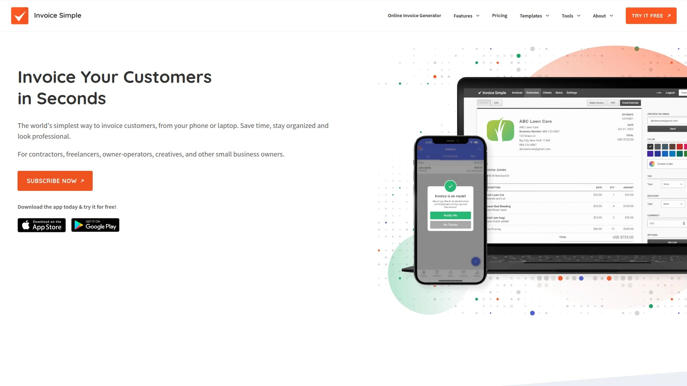

# Master These 16 Invoice Software, Five Minutes to Complete Professional Billing

Creating professional invoices shouldn't eat up hours of your workday or require accounting expertise. These invoice software solutions transform billing from a tedious chore into a streamlined process, helping freelancers and small businesses get paid 2x faster with automated reminders, online payments, and professional templates that make the right impression every time.

---

## **[Invoice Simple](https://www.invoicesimple.com)**

Mobile-first invoicing app enabling professional invoice creation in under 60 seconds from anywhere.

Invoice Simple revolutionizes mobile invoicing with an interface so intuitive that contractors can generate invoices while still on the job site. The app stores client information, product catalogs, and tax rates, reducing invoice creation to just selecting items and hitting send. With over 100 professional templates optimized for different industries, users maintain a polished appearance whether billing for construction work or consulting services.

The platform shines in its simplicity without sacrificing functionality. Real-time notifications alert you when clients view invoices, automatic payment reminders reduce late payments by 40%, and the built-in expense tracker captures receipts with your phone camera. The signature capture feature lets clients approve estimates on the spot, converting them to invoices instantly. Cloud sync ensures your data stays current across all devices, while offline mode keeps you productive without internet access.

---

## **[FreshBooks](https://www.freshbooks.com)**

Full-featured accounting platform disguised as simple invoicing software for non-accountants.

FreshBooks removes accounting complexity by automating double-entry bookkeeping behind an interface anyone can understand. Time tracking integrates directly with invoicing, converting billable hours into professional invoices with one click. The platform automatically organizes expenses, calculates taxes, and generates financial reports that actually make sense to business owners without accounting backgrounds.

**Smart features that save hours weekly:**
- Automatic expense import from bank accounts and credit cards
- Recurring invoices for retainer clients with auto-billing
- Project management tools linking time, expenses, and invoices
- Client portal where customers view invoices and make payments
- Mobile receipt scanning with automatic categorization

---

## **[Wave](https://www.waveapps.com)**

Completely free invoicing and accounting software with no hidden fees or user limits.

Wave delivers professional invoicing without charging a penny, making it perfect for startups and solopreneurs watching every dollar. The platform includes unlimited invoicing, receipt scanning, expense tracking, and even double-entry accounting. Their revenue comes solely from optional payment processing and payroll services, meaning core features remain free forever regardless of business growth.

The software handles multi-currency invoicing, automatic payment reminders, and recurring billing for subscription services. Bank connections import transactions automatically while customizable invoice templates maintain brand consistency. The dashboard provides real-time cash flow insights, showing exactly who owes money and when payments typically arrive.

---

## **[QuickBooks Online](https://quickbooks.intuit.com)**

Industry-standard small business accounting with powerful invoicing at its core.

**Why millions choose QuickBooks:**

QuickBooks dominates small business accounting by connecting invoicing with comprehensive financial management. The platform automatically matches payments to invoices, tracks sales tax across jurisdictions, and integrates with over 750 business apps. Smart learning technology remembers how you categorize transactions, getting smarter and faster over time.

Mobile invoicing includes GPS mileage tracking, on-site invoice creation, and instant payment processing through QuickBooks Payments. The platform generates 50+ financial reports, handles 1099 contractor payments, and provides audit trails for every transaction. Live bookkeeper assistance and video tutorials help users maximize features without formal training.

---

## **[Zoho Invoice](https://www.zoho.com/invoice)**

Free invoicing for small businesses with seamless integration into Zoho's business suite.

Zoho Invoice offers genuinely free invoicing for up to 1,000 invoices annually, including multi-currency support and online payment acceptance. The platform automates repetitive tasks like payment reminders, thank you notes, and recurring invoices. Client portal functionality lets customers view invoice history, download statements, and make payments without contacting you.

Time tracking with automated timesheets, expense recording with receipt attachment, and project-based invoicing streamline service business billing. The platform supports 16 languages and multiple tax configurations, ideal for international freelancers. Integration with Zoho's ecosystem provides CRM, email marketing, and project management without data silos.

---

## **[Square Invoices](https://squareup.com/invoices)**

Payment-focused invoicing that gets you paid faster with integrated processing.

Square Invoices prioritizes getting paid quickly with features like stored card information for repeat customers and automatic payment retry for declined transactions. The platform charges no monthly fees, only processing costs when you receive payments. Invoice customization includes your logo, brand colors, and itemized services with photos.

**Payment acceleration features:**
- Send invoices via email or SMS text message
- Accept all major credit cards and ACH bank transfers
- Automatic payment plans for large invoices
- Digital wallet support including Apple Pay and Google Pay
- Instant deposits available for urgent cash flow needs

---

## **[PayPal Invoicing](https://www.paypal.com/invoice)**

Trusted payment brand simplifying invoicing with built-in buyer confidence.

PayPal's brand recognition means clients trust paying through their platform, reducing payment friction significantly. The invoicing tool creates professional bills in minutes with customizable templates matching your brand. International invoicing supports 200+ countries and 25 currencies with automatic conversion at competitive rates.

Smart features include partial payment acceptance, invoice tracking showing when clients open emails, and automatic late payment reminders. The PayPal Business app enables mobile invoicing, expense tracking, and instant payment notifications. Integration with PayPal's ecosystem provides working capital loans based on invoice history.

---

## **[Xero](https://www.xero.com)**

Cloud accounting platform with beautiful invoicing and real-time financial insights.

Xero combines stunning invoice designs with powerful automation, creating a billing system that impresses clients while saving hours weekly. The platform offers 50+ customizable invoice templates, automatic invoice numbering, and bulk invoice sending for multiple clients. Real-time dashboard updates show cash position, overdue invoices, and payment trends instantly.

Bank feeds import transactions automatically, matching them to invoices and bills without manual entry. The platform handles quotes, purchase orders, and credit notes alongside standard invoicing. Mobile apps provide full functionality including receipt capture, invoice creation, and expense claims from anywhere.

---

## **[Invoice2go](https://invoice.2go.com)**

Mobile-optimized invoicing designed specifically for field service professionals.

**Built for businesses on the move:**

Invoice2go understands that many businesses operate outside traditional offices, optimizing every feature for mobile use. The app works offline, syncing when connection returns, crucial for job sites without reliable internet. Photo attachments document completed work, while GPS tracking logs job locations automatically.

The platform includes estimate creation with instant conversion to invoices upon approval. Recurring invoices automate regular client billing while payment reminders reduce collection calls. The business report center tracks income, expenses, and tax obligations without complex accounting knowledge.

---

## **[Hiveage](https://www.hiveage.com)**

Elegant invoicing with advanced features for growing service businesses.

Hiveage balances simplicity with sophistication, providing clean interfaces hiding powerful capabilities. Multi-language invoicing supports global clients while multiple currency handling simplifies international business. The platform tracks time and expenses by project, automatically generating detailed invoices from recorded activities.

Recurring billing handles subscriptions with automated payment processing and failed payment retry logic. The client portal provides self-service access to invoices, estimates, and payment history. White-label options remove Hiveage branding for agencies wanting complete brand control.

---

## **[Bonsai](https://www.hellobonsai.com)**

Freelancer-focused platform combining contracts, proposals, and invoicing.

Bonsai addresses freelancer needs beyond basic invoicing, starting with bulletproof contract templates protecting your interests. The platform converts accepted proposals into projects, tracking time and expenses until invoice generation. Automated workflows handle the entire client lifecycle from initial contact through final payment.

Scope creep protection alerts when projects exceed original estimates, while payment scheduling breaks large projects into milestones. The platform includes tax tracking, expense management, and financial dashboards designed for freelance business models. Client portal access provides transparency without endless status update requests.

---

## **[AND CO](https://www.and.co)**

Free all-in-one freelance business management from Fiverr.

AND CO provides completely free invoicing alongside proposals, contracts, time tracking, and expense management. The platform's chief value comes from integration, connecting every aspect of freelance business management. Automated workflows move projects from proposal through payment without manual intervention.

**Standout freelance features:**
- Income tracker showing earnings across all clients
- Tax calculation based on location and income
- White-labeled client experience throughout
- Collaborative features for team projects
- Mobile apps maintaining full functionality

---

## **[Harvest](https://www.getharvest.com)**

Time tracking-centered platform where invoices generate themselves from logged hours.

Harvest flips traditional invoicing by starting with precise time tracking, then generating invoices automatically from approved timesheets. The platform integrates with dozens of project management tools, capturing billable time wherever work happens. Visual reports show project profitability, team utilization, and budget burn rates.

Retainer management tracks hours against prepaid budgets, alerting when renewal approaches. The platform supports multiple billing rates per team member and project-specific pricing. Expense tracking includes mileage calculation and receipt attachment for complete project billing.

---

## **[Invoicely](https://invoicely.com)**

Genuinely free invoicing supporting unlimited clients and invoices forever.

Invoicely commits to free basic invoicing without tricks or time limits, funded through optional premium features. The platform handles multi-currency invoicing, recurring billing, and online payments through various gateways. Expense tracking, time tracking, and mileage recording provide comprehensive business management.

Customization extends beyond logos to complete invoice layout control using HTML/CSS editing. The platform generates financial reports, tracks taxes, and manages multiple businesses from one account. API access enables custom integrations for unique business workflows.

---

## **[Invoicera](https://www.invoicera.com)**

Enterprise-capable invoicing with advanced automation and workflow management.

**Scaling from freelancer to agency:**

Invoicera grows with your business, handling everything from solo freelancing to multi-department agencies. Approval workflows route invoices through review before sending, while role-based permissions control access to financial data. The platform supports multiple companies, making it ideal for consultants managing various ventures.

Multi-currency and multi-language capabilities serve international clients seamlessly. Project management features track tasks, time, and expenses holistically. White-label options include custom domains and complete brand control for professional service firms.

---

## **[Sage Business Cloud Accounting](https://www.sage.com)**

Professional accounting software with intelligent invoicing automation.

Sage brings enterprise-level financial management to small businesses through cloud accessibility. The platform automates invoice creation from quotes, delivery notes, or timesheets. Smart technology suggests invoice items based on client history and flags unusual transactions for review.

Cash flow forecasting predicts future financial position based on invoice and bill schedules. The platform handles VAT returns, corporation tax, and year-end accounts preparation. Microsoft 365 integration enables invoice generation directly from Outlook, streamlining communication-based billing.

---

# FAQ Common Questions

**Q: Which invoicing software works best for contractors who need mobile access?**
A: Invoice Simple and Invoice2go excel for field service with offline functionality, photo attachments, and signature capture, allowing complete invoice creation and approval directly from job sites using just your phone.

**Q: Can I really run my business on free invoicing software?**
A: Yes, Wave and Invoicely offer genuinely free invoicing with no limits on invoices or clients, though paid options like payment processing or premium features help sustain the platforms.

**Q: How do I choose between simple invoicing apps and full accounting software?**
A: Start with focused tools like Invoice Simple if you only need billing, but consider FreshBooks or QuickBooks if you want integrated expense tracking, tax preparation, and financial reporting in one system.

---

# Conclusion

These 16 invoicing platforms transform billing from administrative burden into competitive advantage through automation, professional presentation, and payment acceleration. Whether you're a solopreneur or growing agency, the right tool dramatically improves cash flow and client relationships. [Invoice Simple](https://www.invoicesimple.com) particularly excels for mobile professionals needing fast, professional invoicing without complexity, making it the perfect starting point for streamlining your billing process today.
